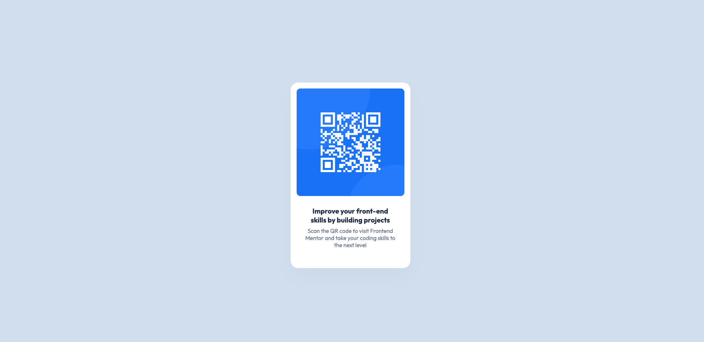

# Frontend Mentor - QR code component solution

This is a solution to the [QR code component challenge on Frontend Mentor](https://www.frontendmentor.io/challenges/qr-code-component-iux_sIO_H). Frontend Mentor challenges help you improve your coding skills by building realistic projects. 

## Table of contents

- [Overview](#overview)
  - [Screenshot](#screenshot)
  - [Links](#links)
- [My process](#my-process)
  - [Built with](#built-with)
  - [What I learned](#what-i-learned)
  - [Continued development](#continued-development)
  - [Useful resources](#useful-resources)
- [Author](#author)

**Note: Delete this note and update the table of contents based on what sections you keep.**

## Overview

### Screenshot

### Links

- Solution URL: [Add solution URL here](https://your-solution-url.com)
- Live Site URL: [Add live site URL here](https://your-live-site-url.com)

## My process

### Built with

- HTML
- CSS 
- Flexbox

### What I learned

This was fairly straight forward project. But I am still learning and getting used to HTML and CSS. 
One thing I keep making mistakes on is being sure I am targeting the right elements with my CSS to get it to do what I want to do.
I also learned a little more about targeting the right element with Flexbox to get it to center on the page.

### Continued development

I want to get more comfortable with laying out a web page and content. I still get confused on how exactly to center and align things in an efficient way.

### Useful resources

- [Drop Shadow Resource](https://developer.mozilla.org/en-US/docs/Web/CSS/filter-function/drop-shadow) - This helped me figure out how to add the drop shadows correctly.

## Author

- Frontend Mentor - [@yourusername](https://www.frontendmentor.io/profile/MattJM1007)
